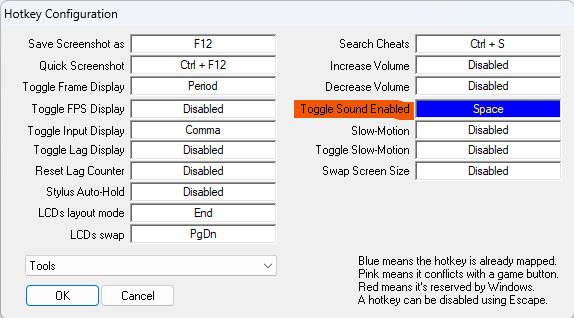

## Getting started - DeSmuME

1. Download the DeSmuME exe first and run it (see downloads section)
2. Try to open a ROM, this creates the ROM folder
3. Follow the Setup guide bellow
4. Close DeSmuME
5. Download the Pokemon Platinum ROM (see downloads section)
6. Place the Platinum ROM in the ROM folder created by DeSmuME
7. Open DeSmuME and load the ROM

### Downloads

**DeSmuME + Platinum ROM**

> DeSmuME Download: https://drive.google.com/file/d/1CH1cliy5kPiPoHUuvHU9K7oDFYYbUh6q/view?usp=drive_link
>
> ROM Download: https://serve.emulatorgames.net/roms/nintendo-ds/Pokemon%20Platinum%20Version%20(US)(XenoPhobia).zip

### Setup

> DeSmuME Setup Guide:  https://www.youtube.com/watch?v=JIr3Q-IPFUE

1. First off, before booting platinum, lower the volume by going to `Config > Sound > volume slider` (5 is more then acceptable, 100 is deafening)
2. Setup fastforwarding as described bellow:

> 
> 

3. Setup frameskip as described bellow:

> 

4. Setup emulation controls as described bellow:

> 

5. Setup LCD layout as described bellow:

> 

### About save states 

- **Save state 1 (ROM_NAME.ds1):** a state in which the intro sequence (the introduction menu where prof. Rowan asks you a bunch of stuff + naming yourself and the rival) has been played trough, meaning it starts in the bedroom (before talking to the rival). The save state is intented for restarting a run. DO NOT OVERWRITE THIS STATE!
- **Save state 9 (ROM_NAME.ds0):** a state in which the game is 100% completed. It has a party full of level 100 Pokemons (including one's for HM purposes), all items, all gyms etc. for manual testing. DO NOT OVERWRITE THIS STATE!
- **All other states**: reserved for eventually running the code on the game.

## Getting started - Pokemon Showdown

```bash
pip install poke-env
git clone https://github.com/smogon/pokemon-showdown.git emulation/pokemon-showdown
cd emulation/pokemon-showdown
node pokemon-showdown start --no-security
```